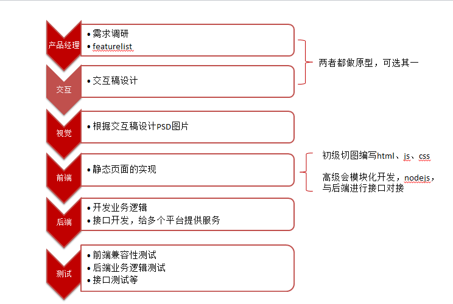
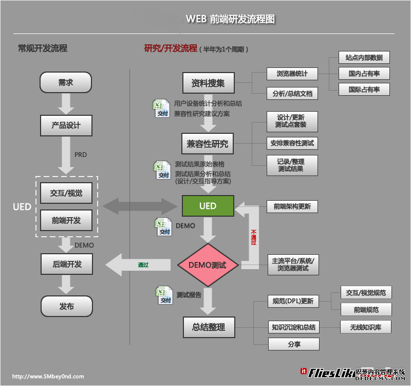
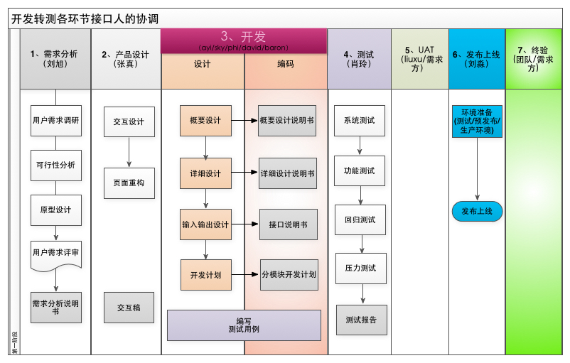

[TOC]
# WEB网站设计流程

## 开发流程图

#### 前端详细流程图

## 借鉴

### [AA公司流程](http://www.yixieshi.com/ucd/3729.html)

	需求调研——制作BRD——BRD评审——
	项目启动会——featurelist、DEMO——featurelist评审——
	交互设计——视觉设计——制作PRD——PRD评审——
	前端HTML ——HTML评审——
	技术开发——预发布——上线运营——改进

### BB公司流程

	体验需求分析——总体设计——UI设计页面设计——程序设计——项目整合——调试——架设+维护

### CC公司流程
	

## 岗位介绍及能力要求

### 产品经理（Product Manager）
需求调研、挖掘需求、画原型写各种文档（BRD[^BRD]、MRD[^MRD]、PRD[^PRD]、产品说明文档、产品使用文档等）

### 交互设计师（Interaction Designer）
负责公司软件产品的UE、UI设计，产出交互稿（Axure RP），有时候需UED[^UED]合作

	最低要求：若视觉设计师能根据项目文档画图，可以不需要交互，
			  但若网站用户体验要求高，交互是必须的

### 视觉设计师（GUI Designer）
根据交互稿设计网页，主要使用工具PS、AI 
	
	最低要求：熟练运用PS、AI等作图工具

### 前端工程师（Web Developer）
将交互稿转成静态html网站

	最低要求：会写html js css，尽量少用插件！
	最好要求：会模块式开发，懂nodejs,angularjs等，
	          对大型网站开发很重要

### 后端开发工程师
业务逻辑开发，多平台接口开发

### 测试工程师

1. 前端的兼容性测试
2. 后端的接口测试

## 扩展知识

[以用户为中心的Web网站设计流程](http://www.woshipm.com/pmd/17781.html)[^YHTY]

[^BRD]: Business Requirement Document，简称商业需求描述。基于商业目标或价值所描述的产品需求内容文档（报告），通常是由产品经理，产品市场经理、商业分析师编写，一般为word文档或ppt文档。

[^MRD]: Market Requirements Document，简称市场需求文档，这个阶段PD(Product Director、produce designer)可能的产出物有Mind Manager的思维图，Excel的Feature List等

[^PRD]: Product Requirement Document ，该文档是产品项目由“概念化”阶段进入到“图纸化”阶段的最主要的一个文档，其作用就是“对MRD中的内容进行指标化和技术化”，这个文档的质量好坏直接影响到研发部门是否能够明确产品的功能和性能。主要产出物有UC（use case）文档、Visio做的功能点业务流程，有时候也会有UI/UE支持，出高保真的demo等

[^UED]: User Experience Design(用户体验设计)，团队包括：交互设计师(Interaction Designer)、视觉设计师(Vision Designer)、用户体验设计师(User Experience Design)、用户界面设计师(User Interface Design)和前端开发工程师(Web Developer) etc...

[^YHTY]: 用户体验的五层结构:战略层：明确公司与用户对于网站的期望和目标；范围层：将战略层确定的目标转化为网站提供的功能和内容；结构层：设计网站架构图，将分散的功能和内容组成一个整体；框架层：将抽象的架构图转化为详细的线框图，确定界面外观、导航信息及信息要素的布局；表现层：按照“低保真”的线框图设计出最终的Web网站。

